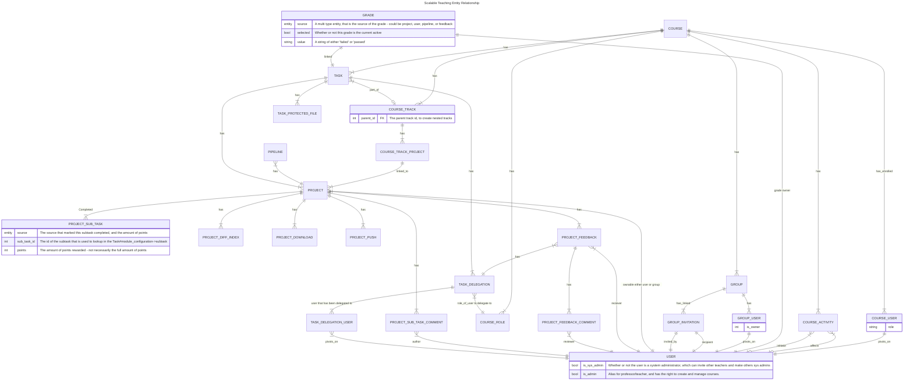

# Entity Relationship Diagram over the Scalable Teaching System.

_NOTE: The survey tables are missing from this, as it is not something I have interacted with._

This should give a brief overview of how everything connects, instead of having to manually dig through the tables.

This ER diagram **DOES NOT** contain model fields, only a few has been picked out and described, as the purpose is more to document the relations and not the actual models itself.

